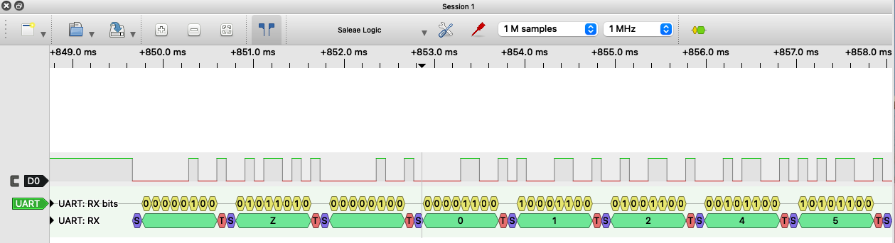

# AmbientCO2

*Arduino library for CozIR Ambient CO2 sensors*

The CozIR Ambient family of sensors all provide CO2 measurements, at different ranges. Some are able to measure temperature and relative humidity as well. The sensors use serial UART and analog voltage output.

This library has been developed using a **CozIR Ambient 0-5000 ppm CO2 (only)** sensor and an **Arduino UNO R3** board.


# Background

The sensor sends 8-bit packages (bytes) of data over serial UART. These bytes must be decoded to get a proper measurement, like an integer.

Using a logic analyzer with UART decoding, we can see both the raw bytes from the sensor (D0 and UART: RX bits below) and the decoded data (UART: RX below):



In this example, the sensor sent " Z 01245". The "Z" tells us it is a filtered CO2 measurement, and the value is 1245 ppm.

The library takes care of setting up the sensor for serial UART communication with the Arduino board, and converting the raw bytes into integer values for further use in our Arduino sketches.


# Development

Milestone | Features | Version | Status
-------- | -------- | -------- | --------
Beta | Basic reading | 0.x.x | :heavy_check_mark:
Launch | Modes, settings | 1.x.x |
Sensors | Range, CO2, relative humidity, temperature | 2.x.x |
Boards | Arduino UNO, Due, MEGA | 3.x.x |


# Library Documentation

Add the following line to use this library:
``` c++
#include <AmbientCO2.h>
```

## Functions

Name | Parameters | Returns | Description
-------- | -------- | -------- | --------
AmbientCO2() | void | void | Constructor
begin() | Stream &serialPort | bool | Sensor setup, defaults to streaming mode
getCO2() | none | int | Reads CO2 concentration in PPM
getMode() | none | int | Returns sensor mode
isConnected() | none | bool | Checks sensor connection
setMode() | int | bool | 0 (command), 1 (streaming) or 2 (poll)

## Limitations

From [SoftwareSerial reference](https://www.arduino.cc/en/Reference/SoftwareSerial): If using multiple software serial ports, only one can receive data at a time.


# Installation

## Library Manager

1. Open Tools -> Manage Libraries... in Arduino IDE
2. Search for *AmbientCO2*
3. Install latest version

## Manual

1. Download library [zip file](https://github.com/mjackdk/AmbientCO2/archive/master.zip) from GitHub, and extract it
2. Rename resulting folder from *AmbientCO2-master* to *AmbientCO2*
3. Move folder *AmbientCO2* into the Arduino IDE [libraries folder](https://www.arduino.cc/en/Guide/Libraries)
4. Restart Arduino IDE, if running


# Usage

1. Examples are available under File -> Examples -> AmbientCO2 in Arduino IDE
2. Change rxPin and txPin in the sketch to match board setup
3. Connect GND, 3.3V, rxPin and txPin between board and sensor (see [User's Manual](http://co2meters.com/Documentation/Manuals/Manual_GC_0024_0025_0026_Revised8.pdf), page 7, for sensor pinout)

Board | Sensor
-------- | --------
GND | Pin 1
3.3V | Pin 3
rxPin | Pin 7
txPin | Pin 5

4. Upload sketch
5. Open Serial Monitor or Serial Plotter in Arduino IDE


# Sensor Documentation

* [Product page](https://www.co2meter.com/collections/0-1-co2/products/cozir-ambient-5000-ppm-co2-sensor)
* [Data sheet](https://cdn.shopify.com/s/files/1/0019/5952/files/Datasheet_COZIR_A_CO2Meter_4_15.pdf)
* [User's Manual](http://co2meters.com/Documentation/Manuals/Manual_GC_0024_0025_0026_Revised8.pdf)
* [Application Note](http://co2meters.com/Documentation/AppNotes/AN128-COZIRWR-arduino-uart.pdf)
  and [sample code](http://co2meters.com/Documentation/AppNotes/AN128-COZIRWR-arduino-uart.zip)


# Inspiration

## Arduino Libraries

* [Writing a Library for Arduino](https://www.arduino.cc/en/Hacking/LibraryTutorial)
* [Arduino Style Guide for Writing Libraries](https://www.arduino.cc/en/Reference/APIStyleGuide)
* [How to Write A Great Arduino Library](https://www.sparkfun.com/news/3245)

* [Genericizing Arduino Libraries](https://www.sparkfun.com/news/2194)
