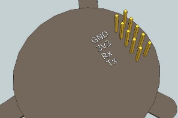

# CozirAmbient
*Arduino library for CozIR Ambient CO2 sensors*

The CozIR Ambient family of sensors all provide CO2 measurements, at different ranges. Some are able to measure temperature and relative humidity as well. The sensors use serial UART and analog voltage output.

This library has been developed using a **CozIR Ambient 0-5000 ppm CO2 (only)** sensor and an **Arduino Uno R3** board.

# Installation
1. Download library [zip file](https://github.com/mjackdk/CozirAmbient/archive/master.zip) from GitHub, and extract it
2. Rename resulting folder from *CozirAmbient-master* to *CozirAmbient*
3. Move folder *CozirAmbient* into your Arduino IDE [libraries folder](https://www.arduino.cc/en/Guide/Libraries)
4. Restart Arduino IDE, if running

# Usage
1. Examples are available under File -> Examples -> CozirAmbient in Arduino IDE
2. Change Rx and Tx pins in the sketch to match your setup
3. Connect 3.3V, GND, Rx and Tx between board and sensor
4. Upload sketch
5. Open Serial Monitor

(Illustration from *User's Manual* page 7)

# Sensor Documentation
* [Product page](https://www.co2meter.com/collections/0-1-co2/products/cozir-ambient-5000-ppm-co2-sensor)
* [Data sheet](https://cdn.shopify.com/s/files/1/0019/5952/files/Datasheet_COZIR_A_CO2Meter_4_15.pdf)
* [User's Manual](http://co2meters.com/Documentation/Manuals/Manual_GC_0024_0025_0026_Revised8.pdf)
* [Application Note](http://co2meters.com/Documentation/AppNotes/AN128-COZIRWR-arduino-uart.pdf)
  and [sample code](http://co2meters.com/Documentation/AppNotes/AN128-COZIRWR-arduino-uart.zip)

# Inspiration

## Arduino Libraries

* [Writing a Library for Arduino](https://www.arduino.cc/en/Hacking/LibraryTutorial)
* [Arduino Style Guide for Writing Libraries](https://www.arduino.cc/en/Reference/APIStyleGuide)
* [How to Write A Great Arduino Library](https://www.sparkfun.com/news/3245)

## Generic Arduino Libraries
* [Genericizing Arduino Libraries](https://www.sparkfun.com/news/2194)
